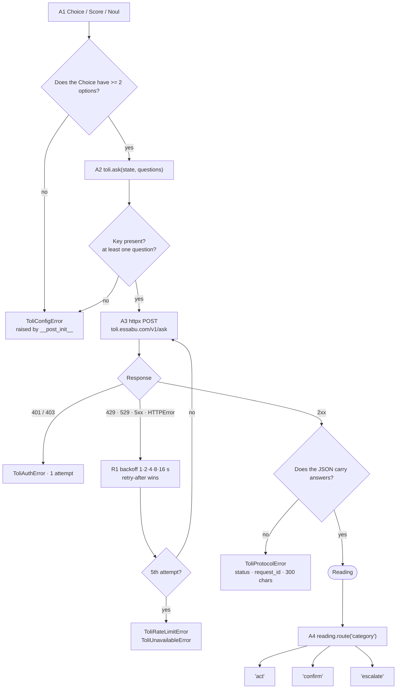

# Toli for Python

[](https://pypi.org/project/toli/)

Typed decisions with a calibrated confidence, and the three-route rule that
keeps a human in the loop.

```bash
pip install toli
```

Python 3.10+, one dependency (`httpx`), fully typed (`py.typed`).

---

## In one screen

```python
from toli import Choice, Noul, Score, Thresholds, Toli

toli = Toli(
    os.environ["TOLI_API_KEY"],
    thresholds=Thresholds.measured(
        act=0.85,
        confirm=0.60,
        measured_on="896 support tickets, French",
        measured_at="2026-09-18",
    ),
    model="toli-1",
)

reading = toli.ask(
    # Send what is needed to judge — and nothing more. A name or a phone number
    # has no bearing on a category and no business leaving your infrastructure.
    {
        "interface": ticket.interface,
        "feature": ticket.feature,
        "description": ticket.description,
    },
    {
        "category": Choice(
            instructions="Which team should handle this ticket",
            criteria={
                "application": "The application misbehaves",
                "hardware": "A device is broken or missing",
                "synchronization": "Data does not sync",
                "other": "None of the above",
            },
        ),
        "urgent": Noul("The sender is blocked from working today"),
        "tone": Score(
            instructions="How frustrated the sender appears",
            criteria=["Calm", "Frustrated but civil", "Angry, strong language"],
        ),
    },
)

match reading.route("category"):
    case "act":
        ticket.assign_to(reading.value("category"))
    case "confirm":
        ticket.suggest(reading.value("category"))
    case "escalate":
        ticket.queue_for_triage()

if reading.answer("urgent").is_yes and reading.route("urgent") == "act":
    ticket.raise_priority()

logger.info("toli.reading", extra=reading.to_log())
```

All three questions travel in **one** request. Asking them separately would cost
three times as much and take three times as long, for the same answers.

> Write question instructions in English: the model is trained on English first.
> Measure before writing them in another language.

---

## What happens when you call `ask()`



`ToliConfigError` is a `ValueError` and **not** a `ToliError`: a caller catching
Toli errors in order to retry must not silently swallow its own configuration
bugs.

---

## Domains where acting alone is not an option

```python
# Clinical orientation, screening: the "act" route does not exist.
thresholds = Thresholds.advisory_only(
    confirm=0.60,
    measured_on="screening cohort, 2026",
    measured_at="2026-09-19",
)
```

No confidence, not even 0.999, returns `"act"` under this mode: at best
`"confirm"`, which a qualified person accepts or rejects. The `advisory` flag
travels in `to_log()`, so a reading can be shown afterwards never to have been
able to act alone.

---

## The API

| Object | What it does |
|---|---|
| `Toli(api_key, *, base_url, thresholds, model, client, sleep)` | The client; only change `base_url` for local development |
| `toli.ask(state, questions, model=None)` | One call, every question, returns a `Reading` |
| `Choice(instructions, criteria)` | Closed set; refuses fewer than two options |
| `Score(instructions, criteria)` | Ordered levels, weakest to strongest |
| `Noul(instructions)` | A statement; returns the probability of yes |
| `reading.route(name)` | `"act"` / `"confirm"` / `"escalate"` |
| `reading.value(name)` | The chosen option, the score, or the probability |
| `reading.answer(name)` | `certainty`, `probabilities`, `legend`, `is_yes` |
| `reading.to_log()` | Model, thresholds, routes, distributions — never the state |
| `Thresholds.measured / advisory_only / defaults` | Thresholds: dated, or advisory |

There is deliberately no `decide()` and no `auto_route()`. Toli proposes; your
code disposes.

---

## Errors

| Class | When | Retried for you |
|---|---|---|
| `ToliConfigError` | missing key, inconsistent thresholds, one-option `Choice` | no — fix the call |
| `ToliAuthError` | 401 / 403 | no |
| `ToliRateLimitError` | 429, after five attempts | yes |
| `ToliUnavailableError` | 5xx, 529, `httpx.HTTPError` | yes |
| `ToliProtocolError` | non-JSON body, 200 without `answers`, other 4xx | no |

Each carries `status`, `request_id` and a `body_excerpt` capped at 300
characters — enough to diagnose, too little to spill a state into a log file.

A dropped connection retries like a 429. That rule is not theoretical: three
readings out of 897 were lost before it existed.

---

## Notebooks and measurement

This SDK is the one that measures. A threshold sweep is a loop over your own
corpus, and `reading.to_log()` gives you every probability distribution to
compute agreement, Cohen's κ and coverage yourself — which is how the do-alo
thresholds (0.85 / 0.60) were established on 896 real tickets.

---

## Development

```bash
uv venv && uv pip install -e '.[dev]'
pytest -q        # including the shared conformance suite
mypy             # strict
ruff check .
```

The conformance tests read `../spec/conformance/*.json` — the same fixtures
every other Toli SDK replays.
